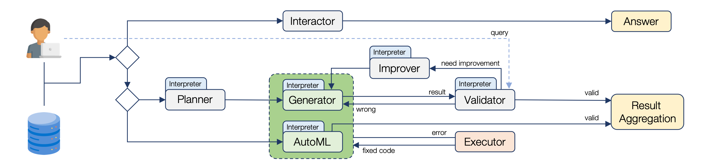

<div align="center">
  
  <h1 align="center">LightAutoDS-Tab</h1>
</div>

<div align="center">


<a href="https://github.com/sb-ai-lab/LADS/blob/main/LICENSE"></a>

</div>



**LightAutoDS-Tab**, a multi-AutoML agentic system for tasks with tabular data, which combines an LLM-based code generation with several AutoML tools.

## 🚀 Quick Start

**Step 1: Clone the repository**

```shell
git clone https://github.com/sb-ai-lab/LADS.git
cd LADS
```

**Step 2: Create conda environment**

```shell
conda create -n LightAutoDS python=3.11
conda activate LightAutoDS
```

**Step 3: Install dependencies**

```shell
pip install -r requirements.txt
```

**Step 4. Set up environment variables**

You need to create a `.env` file in the root directory of the project.

```shell
cp .env_example .env
```

You will need to fill in the required API keys and other environment variables in the `.env` file.

You can also change some parameters in [`config.yml`](./config.yml).

**Step 5: Run the application**

```shell
streamlit run app.py
```

Your application will be hosted on [http://localhost:8501](http://localhost:8501) by default.

## 📜 License

Distributed under the BSD 3-Clause License. See [`LICENSE`](./LICENSE) for more information.

## 🙏 Acknowledgements

This work is supported by the Ministry of Economic Development of the Russian Federation (IGK 000000C313925P4C0002), agreement No. 139-15-2025-010.