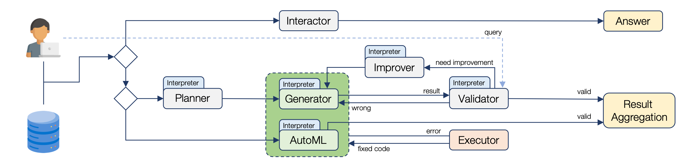
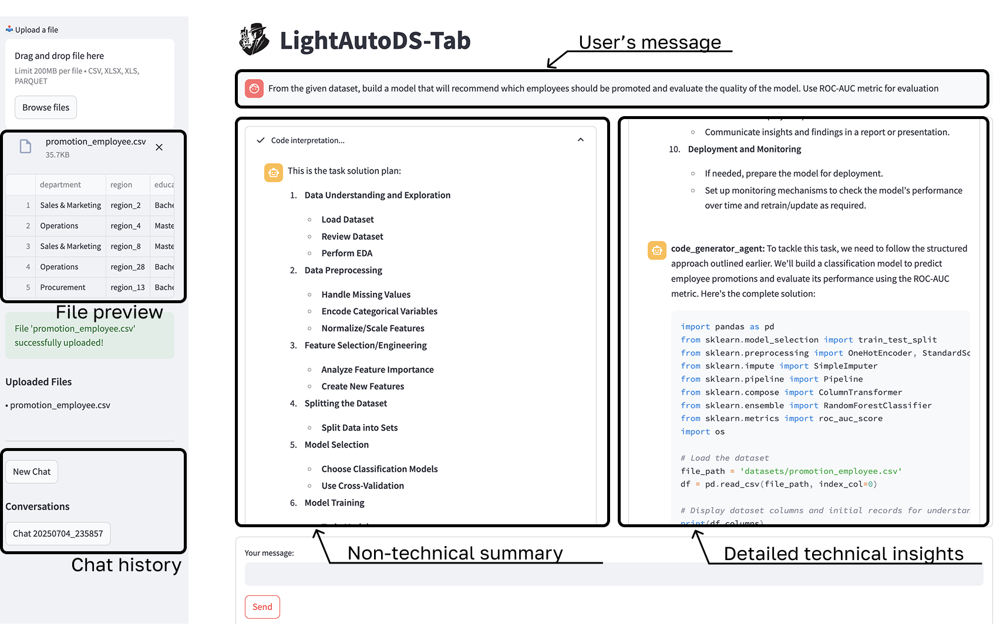
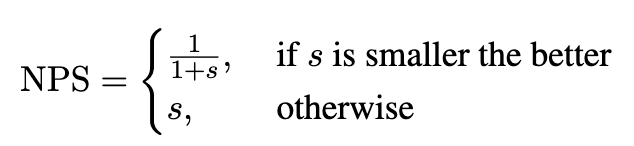
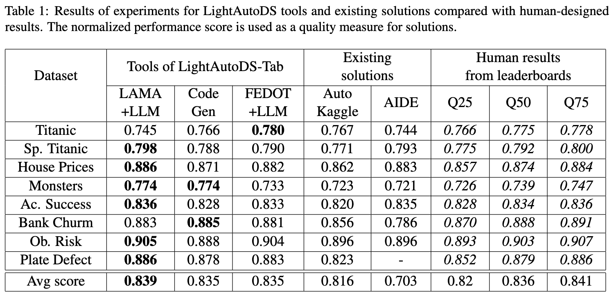
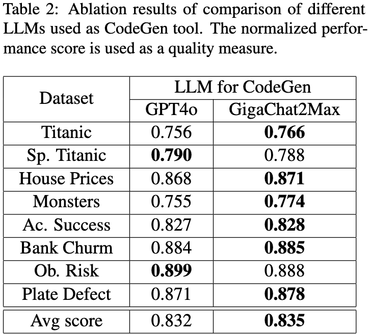

<div align="center">
  
  <h1 align="center">LightAutoDS-Tab</h1>
</div>

<div align="center">


<a href="https://github.com/sb-ai-lab/LADS/blob/main/LICENSE"></a>

</div>



**LightAutoDS-Tab**, a multi-AutoML agentic system for tasks with tabular data, which combines an LLM-based code generation with several AutoML tools.

## ✨ Demo
[Watch the Video](https://www.youtube.com/watch?v=5e8eADd_HWE)

## 🧑‍💻 User interface


The interface includes two main panels:

1. The **right panel** provides detailed *technical insights* into each step of the ML pipeline construction, offering transparency for expert users.
1. The **left panel** presents a simplified, *non-technical summary* of the process, making it easy for non-experts to follow along and understand the results

## 🚀 Quick Start

**Step 1: Clone the repository**

```shell
git clone https://github.com/sb-ai-lab/LADS.git
cd LADS
```

**Step 2: Create conda environment**

```shell
conda env create -f environment.yml
conda activate LightAutoDS
```

**Step 3. Set up environment variables**

You need to create a `.env` file in the root directory of the project.

```shell
cp .env_example .env
```

You will need to fill in the required API keys and other environment variables in the `.env` file.

You can also change some parameters in [`config.yml`](./config.yml).

**Step 4: Run the application**

```shell
streamlit run app.py
```

Your application will be hosted on [http://localhost:8501](http://localhost:8501) by default.

## 📊 Result
We evaluated our framework on eight Kaggle ML datasets and compared it with two state-of-the-art open-source solutions: AutoKaggle and AIDE.

To ensure consistency across competitions, we use the Normalized Performance Score (NPS). This score standardizes the results, with a higher value indicating better performance.

<div style="text-align: center;">
  
</div>



## 📜 License

Distributed under the BSD 3-Clause License. See [`LICENSE`](./LICENSE) for more information.