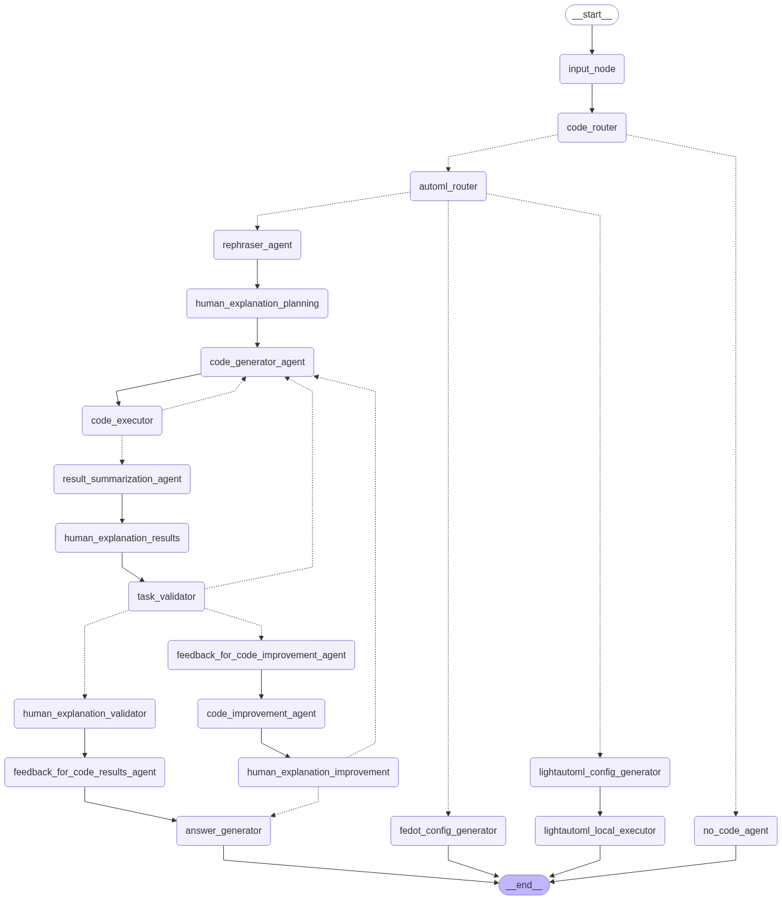

# DS Agent [WIP]

# How to run

1. Create new enviroment with `conda env create -f environment.yml`
> If you already have some enviroment that you would like yo use then you can update it with `conda env update --file environment.yml`
2. Activate your enviroment with `conda activate ds-agent`
3. Copy example env and paste your own keys
`cp .env_example .env`
You can also change some parameters in `config.yml`
4. Start an app `streamlit run app.py`

You can also run your app in docker container with docker compose as simple as `docker compose up -d`

Also you can manage your config and settings in config.yml file

Your app will be hosted on `http://localhost:8501` by default

# Architecture

